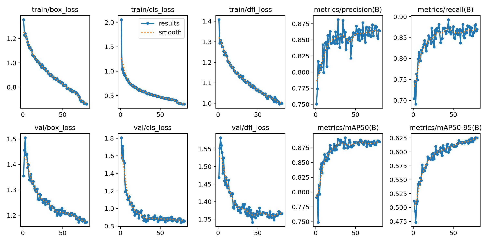
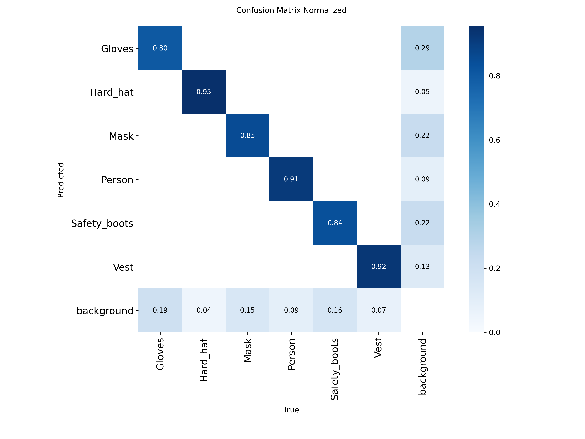

# 🦺 PPE Detection with YOLOv8 — Real-Time Safety Compliance Monitoring


A computer vision system that detects Personal Protective Equipment (PPE) on workers in real-time using YOLOv8 and transfer learning. Designed for industrial safety monitoring in warehouses and construction environments.

▶️ **[Run the notebook on Kaggle](https://www.kaggle.com/code/rubengarciamarquez/ppe-detection-with-yolov8)**

---

## 🎯 Results

| Metric | Value |
|--------|-------|
| **mAP@50** | **88.7%** |
| **mAP@50-95** | **62.5%** |
| **Precision** | **85.2%** |
| **Recall** | **88.1%** |
| **Inference Speed** | **4.6 ms/image (217 FPS)** |

### Per-Class Performance

| Class | Precision | Recall | mAP@50 |
|-------|-----------|--------|--------|
| Hard Hat ⛑️ | 93.3% | 95.5% | **96.8%** |
| Person 🧑 | 91.8% | 91.6% | **95.5%** |
| Safety Vest 🦺 | 87.8% | 92.4% | **94.7%** |
| Safety Boots 👢 | 84.1% | 83.9% | **85.5%** |
| Gloves 🧤 | 78.6% | 79.8% | **82.1%** |
| Mask 😷 | 75.9% | 85.5% | **77.6%** |

### Training Curves



### Confusion Matrix



---

## 🏗️ Architecture

```
Input Image (640x640) → YOLOv8s (pre-trained on COCO, 330K images, 80 classes)
                         ↓ Transfer Learning (fine-tune)
                    PPE dataset (2,114 images, 6 classes)
                         ↓
                    Detection: Hard_hat, Vest, Gloves, Mask, Person, Safety_boots
                         ↓
                    Output: Bounding boxes + Class + Confidence score
```

---

## 🔧 Tech Stack

| Component | Tool |
|-----------|------|
| Model | YOLOv8s (Ultralytics) — 11.1M parameters |
| Training | Transfer learning from COCO pre-trained weights |
| Dataset | 2,114 labeled images via [Roboflow](https://universe.roboflow.com/sdp-lfigk/ppe-detection-ozhfb) |
| Compute | NVIDIA Tesla T4 GPU (Kaggle) |
| Framework | PyTorch 2.x + Ultralytics 8.4 |
| Language | Python 3.12 |

---

## 📊 Training Configuration

| Parameter | Value |
|-----------|-------|
| Epochs | 80 |
| Batch size | 16 |
| Image size | 640×640 |
| Optimizer | AdamW (lr=0.001) |
| Augmentation | Mosaic, HSV, flip, blur, CLAHE |
| Early stopping | patience=15 (not triggered) |
| Training time | ~35 minutes on T4 GPU |

---

## 🚀 Quick Start

```python
from ultralytics import YOLO

# Load the trained model
model = YOLO("weights/best_ppe.pt")

# Run inference on an image
results = model.predict(source="image.jpg", conf=0.4)

# Run on video (real-time)
results = model.predict(source="video.mp4", conf=0.4, save=True)
```

---

## 📁 Project Structure

```
PPE-Detection-YOLOv8/
├── README.md
├── requirements.txt
├── results/
│   ├── results.png                    # Training curves
│   ├── confusion_matrix.png           # Confusion matrix
│   └── confusion_matrix_normalized.png
├── demo/
│   └── ppe_detection_demo.avi         # Video with detections
└── weights/
    └── best_ppe.pt                    # Trained model (22.5 MB)
```

---

## 📝 Key Learnings

1. **Data-centric AI:** Switching from a 25-class generic dataset to a focused 6-class PPE dataset improved mAP from 60.1% to 88.7% — same model architecture, better data.
2. **Transfer learning:** Fine-tuning a COCO-pretrained YOLOv8s with only 2,114 images achieved production-grade accuracy in 35 minutes.
3. **Real-time capability:** 4.6ms inference time (217 FPS) enables deployment on edge devices (NVIDIA Jetson) for live safety monitoring.
4. **Domain gap:** Models trained on close-range photos underperform on overhead CCTV footage — site-specific fine-tuning is required for production deployment.

---

## 🔮 Next Steps

- [ ] Add "NO-Helmet" and "NO-Vest" classes for non-compliance detection
- [ ] Deploy on NVIDIA Jetson for edge inference
- [ ] Add tracking (ByteTrack) for person-level compliance across frames
- [ ] Integrate alert system (MQTT/webhook) for real-time notifications
- [ ] Fine-tune with site-specific CCTV data for overhead camera deployment

---

## 🔗 Links

- 📓 **Kaggle Notebook:** [Run it here](https://www.kaggle.com/code/rubengarciamarquez/ppe-detection-with-yolov8)
- 📦 **Dataset:** [PPE Detection on Roboflow](https://universe.roboflow.com/sdp-lfigk/ppe-detection-ozhfb)
- 🛠️ **Framework:** [Ultralytics YOLOv8](https://docs.ultralytics.com)

---

## 📄 License

MIT License — free for personal and educational use.

---

## 👤 Author

**Rubén García Márquez**
- 🔗 [LinkedIn](https://www.linkedin.com/in/rubén-garcía-márquez-84ab08238)
- 🐙 [GitHub](https://github.com/rubengm-dev)
